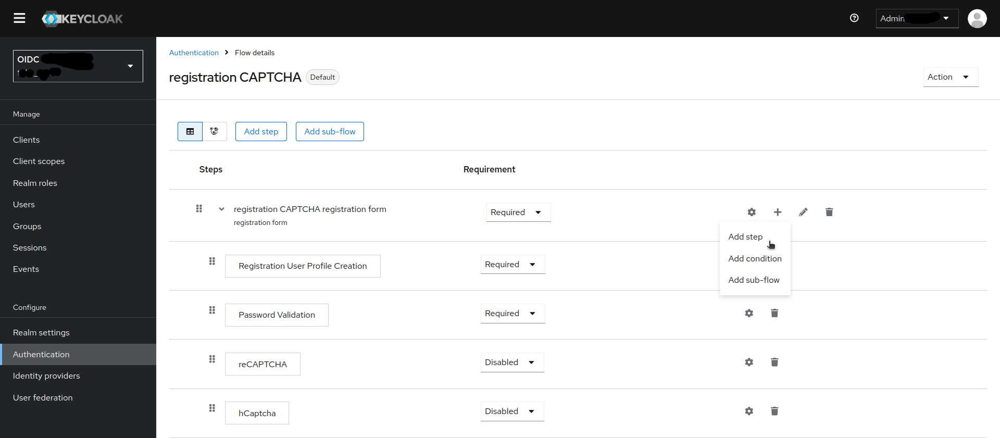

Just a fork from keycloak-hcaptcha to be modified for mosparo

# keycloak-mosparo

> I am currently not adding any new features, updates or fixes. Feel free to open a PR!

To safeguard registration against bots, Keycloak has integration with Google reCAPTCHA. This provides similar functionality, but with a more privacy friendly provider named mosparo. The code is based on the vanilla implementation of reCAPTCHA in Keycloak.

## Installation

Download the newest release JAR (or compile it yourself - see below) and drop it into `your_keycloak_installation/providers`

There are a few steps you need to perform in the Keycloak Admin Console. Click the Authentication left menu item and go to the Flows tab. Select the Registration flow from the drop down list on this page.

Registration Flow
Make copy of the Registration flow, and add the `mosparo` execution to the Registration Form.




The Registration Flow including mosparo

Set the 'mosparo' requirement to Required by clicking the 'Required' button. This will enable mosparoCaptcha on the screen. 


Next, you have to enter in the mosparo site key and secret that you generated at your mosparo Website. Click on the 'Actions' button that is to the right of the mosparo flow entry, then "Config" link, and enter in the mosparo site key and secret on this config page.

mosparo Config Page

Add the hostname/domain of your mosparo host without the protocol-prefix (remove https:// )

Now you have to do is to change some default HTTP response headers that Keycloak sets. Keycloak will prevent a website from including any login page within an iframe. This is to prevent clickjacking attacks. You need to authorize mosparo to use the registration page within an iframe. Go to the Realm Settings left menu item and then go to the Security Defenses tab. You will need to add https://<your.mosparo.instance.tld> to the value of the Content-Security-Policy headers. In the image they are also in the X-Frame-Options, but this is not needed (you can ignore it).

Authorizing Iframes


To show the mosparoCaptcha you need to modify the registration template. 
To modify the theme, you have to modify the register.ftl file in a jar-file unter lib/lib/main/org.keycloak.keycloak-themes-<keycloak-version>.jar. You can unzip the jar, edit the file and repack it again. It also works to edit it directly with vim.

You can find the files in in the jar under `themes/base/login/register.ftl` and `theme/keycloak.v2/login/register.ftl` 
Add the following code beneith the reCaptcha code:

```html
<#if mosparoRequired??>
<div class="form-group">
    <div class="${properties.kcInputWrapperClass!}">
        <div id="mosparo-box"></div>

        <script type="module">
            var m;
            window.onload = function(){
                m = new mosparo(
                   'mosparo-box', 
                   'https://${mosparoHost}',
                   '${mosparoUuid}',
                   '${mosparoPublicKey}', 
                   { loadCssResource: true }
                );
            };
        </script>
    </div>
</div>
</#if>
```
since a few keycloak versions the `https://` before `${mosparoHost}` is needed. Without mosparo will be called as suburl unter login-actions from your keycloak-domain. Ideas for fixes are welcome.

Registration Template


In the last step you have to change the registration flow to the newly created one and save. Once you do this, the mosparoCaptcha shows on the registration page and protects your site from bots!

Authentication Bindings

Click on the 3-dots on the right side on the new 'registration CAPTCHA' flow and 'bind flow' to 'Registration flow'

## Compiling it yourself

Clone the repository:

```bash
git clone https://git.schuerz.at/jakob/keycloak-mosparo.git
```

Inside the repository, compile it using Maven with Java 17:

```bash
mvn clean compile package
```

You can instruct Maven to use a specific Java version by prepending the JAVA_HOME environment variable:

```bash
JAVA_HOME=/usr/lib/jvm/java-17-oracle/ mvn clean compile package
```

## © License
[MIT](LICENSE)
